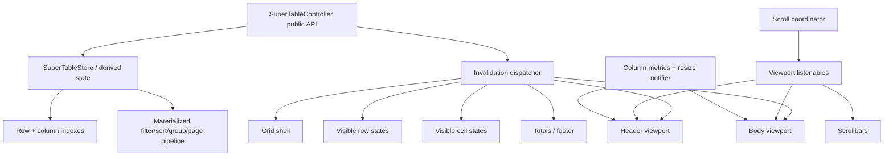

# دراسة معمارية أداء Super Table Field للإصدار 3.0.0

**الحزمة التي تمت مراجعتها:** `super_table_field` 2.8.0  
**المشروع المرجعي:** [`doonfrs/trina_grid`](https://github.com/doonfrs/trina_grid)  
**نسخة Trina Grid التي تمت دراستها:** `e3bffbeea7c5c69de5787bcd521777125031d619` (`v2.3.0`، بتاريخ 2026-07-22)  
**الإصدار المستهدف:** `super_table_field` 3.0.0  
**نوع الدراسة:** مراجعة ثابتة للكود والمعمارية. هذا التقرير **لا يدّعي وجود نسب تسريع مقاسة فعليًا بعد**؛ القياس يجب أن يتم في Profile Mode ضمن خطة الـ benchmark الموضحة أدناه.

---

## 1. الملخص التنفيذي

تملك `super_table_field` أساسًا جيدًا للأداء بالفعل: جسم الجدول يستخدم `ListView.builder`، وبالتالي لا يتم إنشاء جميع الصفوف خارج الشاشة، كما أن الصفوف ذات الارتفاع الثابت تستفيد من `itemExtent`. لكن الفارق الرئيسي مع Trina Grid ليس مجرد Widget تمرير أسرع؛ بل هو **كمية العمل التي يتم تشغيلها مع كل تغيير حالة ومع كل صف يدخل نافذة العرض**.

أهم الأفكار التي أوصي بنقلها من Trina Grid إلى معمارية SuperTable 3 هي:

1. **إبطال حالة دقيق Granular Invalidation بدل إعادة بناء الجدول بالكامل.** لدى Trina مدير حالة واحد، لكن الإشعارات موسومة ومفلترة، وكل جزء من الواجهة يشترك فقط في التغييرات التي تخصه.
2. **Virtualization على المحورين.** Trina ينشئ الصفوف المرئية رأسيًا، ويملك أيضًا نظامًا خاصًا لإنشاء الأعمدة/الخلايا المرئية أفقيًا فقط. أما SuperTable حاليًا فيعمل lazy رأسيًا، لكنه يبني جميع الأعمدة لكل صف ظاهر.
3. **تخزين ناتج data pipeline بصورة materialized.** يجب تنفيذ filtering/sorting/grouping/pagination عند تغير المدخلات، وليس كلما تمت قراءة getter أثناء `build`.
4. **فصل مسارات scroll/layout عن state العامة.** موضع التمرير، قياسات scrollbar، وتغيير عرض العمود يجب أن تحدث عبر `Listenable` أو قناة layout صغيرة من دون إبطال الجدول كله.
5. **هوية ثابتة للصف/الخلية مع revisions.** Trina يستخدم version للصف ومفاتيح ثابتة للخلايا لإبطال الحسابات المشتقة عند الحاجة فقط. لدى SuperTable بالفعل `id` ثابت للصف و`fingerPrint`، ويمكن تطوير هذا الأساس بدل استبداله.

أهم عنق زجاجة وجدته في كود 2.8.0 المرفوع هو `renderList` و`view`. حاليًا يقوم كل getter منهما باستدعاء `_rebuildRenderList()` في كل قراءة. وهذه الدالة تعيد filtering وsorting وgrouping، كما تستخدم `_rows.indexOf(row)` داخل حلقات الصفوف. ثم يقوم `ListView.builder` داخل `SuperTable` بقراءة `c.renderList` أكثر من مرة أثناء بناء العنصر الواحد. النتيجة المحتملة هي أن مجرد دخول صفوف جديدة إلى نافذة العرض قد يعيد تشغيل معالجة كاملة لبيانات الجدول مرارًا.

**لذلك يجب أن تكون هذه أول خطوة في v3.0.0، قبل كتابة scroll engine مخصص.**

الهدف الصحيح ليس “نسخ Trina Grid”، بل بناء **محرك حالة وتصيير جديد لـ SuperTable يستفيد من المبادئ الناجحة في Trina** مع الحفاظ قدر الإمكان على API الحالية، نظام التصميم، الصفوف generic، التحرير، التحقق، التجميع، والميزات الموجودة في الحزمة.

---

## 2. نطاق الدراسة ومنهجيتها

راجعت النسخة المرفوعة من `super_table_field` 2.8.0 مع التركيز على:

- مسار إشعارات `SuperTableController`؛
- pipeline الخاص بالفلترة والترتيب والتجميع والصفحات؛
- طريقة إنشاء الصفوف والخلايا؛
- التمرير الأفقي والرأسي؛
- حل عروض الأعمدة والقياس النصي؛
- hover والاختيار والتحرير؛
- هوية الصفوف والخلايا وفرص التخزين المؤقت.

كما راجعت مستودع Trina Grid الحالي عند الـ commit المحدد أعلاه، وخاصة الملفات التالية:

- `lib/src/manager/trina_grid_state_manager.dart`
- `lib/src/manager/trina_change_notifier.dart`
- `lib/src/manager/trina_change_notifier_filter.dart`
- `lib/src/ui/miscellaneous/trina_state_with_change.dart`
- `lib/src/ui/trina_body_rows.dart`
- `lib/src/ui/trina_base_row.dart`
- `lib/src/ui/trina_base_cell.dart`
- `lib/src/ui/miscellaneous/trina_visibility_layout.dart`
- `lib/src/manager/state/scroll_state.dart`
- `lib/src/widgets/trina_linked_scroll_controller.dart`
- `lib/src/helper/filtered_list.dart`
- أجزاء filtering وcolumn state.

النتائج التالية مبنية على مراجعة الكود والمعمارية. لا يجب ذكر نسبة مثل “أسرع 3×” أو “أسرع 80%” قبل تنفيذ benchmark قابل للتكرار في Profile Mode.

---

## 3. وضع SuperTable 2.8.0 الحالي

### 3.1 نقاط جيدة يجب الحفاظ عليها

لا أوصي بإعادة كتابة الحزمة من الصفر. هناك اختيارات حالية مناسبة جدًا كأساس لمحرك v3 عالي الأداء:

- جسم الجدول يستخدم `ListView.builder`، لذلك الصفوف خارج الشاشة لا تُنشأ كلها.
- استخدام `itemExtent` عندما يكون ارتفاع الصف ثابتًا يقلل تكلفة layout الرأسي.
- domain entities منفصلة أصلًا عن presentation.
- `SuperRow<R>` يملك هوية ثابتة و`fingerPrint` كإشارة لإعادة بناء الموارد المرتبطة بالصف.
- يوجد `SuperTableController<R>` واضح ونظام أعمدة typed غني.
- ميزات editing، validation، selection، grouping، aggregation، pagination، runtime column configuration موجودة بالفعل؛ وبالتالي يمكن تغيير المحرك الداخلي من دون إعادة اختراع المنتج.

### 3.2 مسار إعادة البناء الحالي

في المصدر المرفوع، تقوم `_SuperTableState.initState()` بإضافة listener مباشر إلى controller، ثم تقوم `_onModel()` بتنفيذ:

```dart
setState(() {});
```

مع كل إشعار من controller (`super_table.dart` تقريبًا الأسطر 637–686).

وفي `SuperTableController` يوجد **67 موضعًا لاستدعاء `notifyListeners()`**. هذا يعني أن تغييرات صغيرة منطقيًا—مثل focus أو selection أو filter أو editing—يمكن أن تؤدي إلى إبطال شجرة `SuperTable` كاملة.

المسار التقريبي اليوم هو:

```text
تغيير داخل Controller
       │
       ▼
notifyListeners()
       │
       ▼
_SuperTableState._onModel()
       │
       ▼
setState() على الجذر
       │
       ├── إعادة حساب العروض
       ├── header
       ├── filter row
       ├── body viewport
       ├── gutter
       ├── totals/footer
       └── الصفوف المرئية × جميع الأعمدة
```

الـ vertical lazy building يمنع إنشاء جميع الصفوف دفعة واحدة، لكنه لا يمنع تكرار الكثير من الحسابات داخل المنطقة المرئية.

---

## 4. أكبر اختناقات الأداء الحالية

### P0 — `renderList` و`view` يعيدان تنفيذ data pipeline عند القراءة

في `super_table_controller.dart` تقريبًا الأسطر 1476–1568:

- getter `renderList` يستدعي `_rebuildRenderList()` ثم يعيد `_renderCache`.
- getter `view` يستدعي `_rebuildRenderList()` أيضًا ثم يعيد `_dataView`.
- `nRows` يقرأ `view.length`، وبالتالي يعيد البناء مرة أخرى.
- `_rebuildRenderList()` يبدأ بقراءة `_sorted`.
- `_sorted` يستدعي `_filtered` وقد يقوم بإنشاء نسخة وفرزها.
- `_filtered` قد يمر على جميع الصفوف وعدة أعمدة.

أسماء `_renderCache` و`_dataView` توحي بأن الناتج cached، لكن فعليًا يتم **إعادة بناء الـ cache في كل قراءة**.

وتصبح المشكلة أكبر في `super_table.dart` تقريبًا الأسطر 1541–1565. مسار `ListView.builder` يقرأ `c.renderList.length`، ثم داخل `itemBuilder` يقرأ `c.renderList.length` من جديد، ثم يقرأ `c.renderList[i]`. كل قراءة يمكن أن تعيد filtering/sorting/grouping بالكامل. كما توجد قائمة gutter ثانية تستخدم نفس البيانات.

أي أن الجدول قد يكون lazy من ناحية إنشاء الصفوف، لكنه لا يزال يقوم بعمل CPU على كامل البيانات كلما طلب Flutter صفًا جديدًا مرئيًا.

**إجراء v3:** اجعل الـ derived data materialized فعليًا. يتم إعادة حسابها مرة واحدة فقط عندما تتغير rows أو search أو filters أو sort أو grouping أو collapse state أو page أو page size. أما getters العادية فيجب أن تكون O(1) وبدون allocations كبيرة.

### P0 — إيجاد `sourceIndex` حاليًا يمكن أن يصبح O(n²)

داخل `_rebuildRenderList()` يتم حساب:

```dart
sourceIndex: _rows.indexOf(row)
```

استدعاء O(n) داخل loop على n صفوف يجعل بناء render items يصل إلى O(n²). ويظهر النمط نفسه داخل grouped path.

**إجراء v3:** أنشئ index ثابتًا مثل:

```dart
Map<RowId, int> _sourceIndexById
```

ويعاد بناؤه في O(n) فقط عند تغير هيكل source rows.

### P0 — حل الأعمدة والبحث عنها يكرر allocations وlinear scans

في getters الأعمدة تقريبًا الأسطر 1310–1349 يتم إنشاء `_baseCols` ومجموعات pinned/middle عدة مرات. كما أن `midCols` يأخذ كل key في order ويستخدم `firstWhere` داخل base، وهذا يجعل resolution يصل إلى O(m²). و`colByKey` نفسه linear.

**إجراء v3:** خزّن column layout state بصورة materialized مع:

- `Map<String, SuperColumn> columnByKey`؛
- `Map<String, int> columnIndexByKey`؛
- arrays جاهزة لـ start/middle/end؛
- prefix offsets لأبعاد الأعمدة.

### P1 — تغير بسيط في state يؤدي إلى full-table rebuild

استخدام `ChangeNotifier` العام مناسب كواجهة public compatibility، لكنه واسع جدًا كآلية اشتراك داخلية للـ rendering.

أمثلة:

- تغيير focus يستدعي `notifyListeners()`؛
- hover يستدعي root `setState()` داخل `_setHoveredRow` و`_setHoveredCell`؛
- تحريك selection قد يعيد بناء الجدول بالكامل، بينما الذي تغير فعليًا غالبًا خليتان أو صفان.

**إجراء v3:** أضف قنوات invalidation/revisions دقيقة، واجعل كل component يشترك فقط في الإشارات التي يحتاجها.

### P1 — لا يوجد horizontal cell virtualization

يقوم `SuperTable` بوضع محتوى الأعمدة الكامل داخل `SingleChildScrollView` أفقي. ولكل صف مرئي، تقوم `_buildRow()` بالمرور على **جميع الأعمدة**:

```dart
for (var ci = 0; ci < cols.length; ci++)
  _bodyCell(...)
```

إذا كان هناك 20 صفًا مرئيًا و100 عمود، يمكن لجسم الجدول أن ينشئ/يعالج تقريبًا 2,000 خلية، حتى لو كانت الشاشة تعرض 8–12 عمودًا فقط.

`TrinaVisibilityLayout` يعالج هذه المشكلة مباشرة؛ فهو يفعّل فقط الخلايا التي تتقاطع مع النافذة الأفقية الحالية، ويلغي العناصر خارجها.

**إجراء v3:** نفّذ virtualization أفقيًا للأعمدة الوسطية، مع الإبقاء على pinned start/end panes، ومع إبقاء الخلية المحررة/current cell حية عند الحاجة.

### P1 — `maxCell` يقيس جميع الصفوف داخل width resolution

الدالة `_maxCellWidth()` في `super_table.dart` تقريبًا الأسطر 1390–1429 تمر على جميع rows وتستخدم `TextPainter.layout()` لقيمة كل صف المعروضة. وقد يتم استدعاؤها من `_resolveColumnWidths()` أثناء build.

إذا تسبب focus/hover/selection في root rebuild، قد تعاد القياسات المكلفة رغم أن البيانات والخط والعرض المنطقي لم تتغير.

**إجراء v3:** cache للـ intrinsic width لكل عمود مرتبط بـ content/style revision، ولا يُبطل إلا عند تغير القيم ذات العلاقة أو formatter أو font/style أو إعداد العمود.

### P2 — مزامنة gutter يدويًا مع `jumpTo`

الـ vertical scroll الرئيسي يقود gutter scroll controller ثانيًا يدويًا باستخدام `jumpTo()` داخل `_syncGutter()`.

هذا يعمل، لكنه يضيف مسار مزامنة في كل scroll update.

**خيارات v3:** إما دمج row-number gutter ضمن نفس row الافتراضي رأسيًا، أو استخدام linked scroll positions على غرار Trina عندما تكون هناك عدة panes يجب أن تتحرك معًا.

---

## 5. لماذا Trina Grid سريع عمليًا من منظور المعمارية؟

سرعة Trina ليست ناتجة عن Widget واحد، بل عن مجموعة طبقات تكمل بعضها.

### 5.1 Tagged notifications مع filtered subscriptions

`TrinaChangeNotifier` يرث من `ChangeNotifier` لكنه يرسل أيضًا `TrinaNotifierEvent`. وتستطيع methods في state manager ربط إشعارها بمعرّف يدل على نوع العملية.

ثم يقوم `TrinaChangeNotifierFilterResolverDefault` بربط أنواع Widgets بمجموعات الأحداث التي تهمها. مثلًا body rows تستمع لتغييرات بنية الصفوف/الأعمدة/filter/sort/page، وليس لكل focus أو selection event غير متعلق ببنية الـ rows.

`TrinaStateWithChange` يشترك في stream المفلتر، ثم يقارن القيمة المحلية القديمة والجديدة، ويطلب `markNeedsBuild()` فقط إذا تغير ما يخص ذلك الـ widget.

الدرس المهم هنا ليس RxDart نفسه ولا استخدام `hashCode` للدوال. الدرس هو:

> **شجرة التصيير تستقبل إشارة دلالية توضّح ما الذي تغير، وليس إشعارًا عامًا من نوع “حدث تغيير ما”.**

### 5.2 Row virtualization + horizontal visibility virtualization

يستخدم `TrinaBodyRows` `ListView.builder` أو `TrinaSmoothListView.builder` للصفوف، لكنه يضع خلايا كل صف داخل `TrinaVisibilityLayout`.

`TrinaVisibilityLayout` عبارة عن `RenderObjectWidget` مع Element مخصص. يراقب horizontal scroll controller، ويحسب المدى المرئي، ويبقي فقط الأطفال الذين تتقاطع أبعادهم الأفقية مع النافذة. ويمكنه إبقاء خلية محددة حية عند `keepAlive`.

كما أنه لا يطلب rebuild لكل pixel؛ فهو يحتفظ بحدود آخر منطقة مرئية، وإذا بقي offset الجديد ضمن نفس الحدود لا ينفذ `markNeedsBuild()`.

بهذا يصبح عدد الخلايا الحية أقرب إلى:

```text
عدد الصفوف المرئية × عدد الأعمدة المرئية
```

بدلًا من:

```text
عدد الصفوف المرئية × جميع الأعمدة
```

وهذه نقطة شديدة الأهمية لجداول ERP/accounting التي قد تحتوي 50–150 عمودًا.

### 5.3 Scroll metrics منفصلة عن body rebuild

يستخدم `TrinaBodyRows` عدة `ValueNotifier<double>` للـ vertical/horizontal offset والـ extent والـ viewport metrics. تقوم scroll listeners بتحديث هذه القيم من دون `setState` على body.

ثم تستهلك scrollbars هذه listenables مباشرة. لذلك لا يمر scroll عالي التردد عبر state manager الرئيسي.

### 5.4 فصل relayout عن rebuild أثناء تغيير عرض العمود

layout delegates في Trina تستخدم `resizingChangeNotifier` كمصدر `relayout`. وهذا يسمح لتغيير العرض أثناء drag بإعادة layout فقط بدل اعتبار كل delta تغيير state دلالي يحتاج إعادة بناء grid كاملة.

### 5.5 تجميع mutations قبل الإشعار

تقوم methods كثيرة في Trina بتنفيذ عمليات داخلية بـ `notify: false` ثم ترسل إشعارًا واحدًا في النهاية. مثال ذلك sorting وتغييرات الأعمدة البنيوية.

هذا pattern مناسب جدًا لمسارات SuperTable مثل selection/edit commit/filter reset/group changes/column configuration.

### 5.6 Derived values cached مع row versioning

`TrinaCell` يخزن قيمة مهيأة للترتيب، و`TrinaRow` يملك `version` يزيد عند تغير محتوى الصف. كما تقوم `_CellContainerState` بتخزين نتيجة `checkReadOnly` بناء على cell value وrow version.

المبدأ: الحسابات النقية المشتقة لا يجب أن تتكرر في كل build عندما لم تتغير مدخلاتها.

### 5.7 Linked scroll positions

`LinkedScrollControllerGroup` في Trina يزامن `ScrollPosition`s مباشرة ويمنع تكرار offset notifications إذا لم تتغير القيمة. هذا أنظف من عدة listeners خارجية تنفذ `jumpTo` بشكل متكرر عندما يجب مزامنة header/body/frozen panes.

---

## 6. ما الذي ننقله من Trina وما الذي لا يجب نسخه حرفيًا؟

| تقنية في Trina | التوصية لـ SuperTable 3 | السبب |
|---|---|---|
| Tagged state changes | **نقل الفكرة** | أساس granular rebuilds |
| Widget-specific notification filtering | **اعتمادها** | تمنع rebuild غير المرتبط |
| Vertical `ListView.builder` | **الاستمرار بالحل الحالي** | SuperTable يملك الأساس الصحيح أصلًا |
| Horizontal visibility virtualization | **اعتمادها مع تحسين التنفيذ** | مكسب كبير للجداول العريضة |
| ValueNotifiers للـ scroll metrics | **اعتمادها** | تفصل scroll عن root state |
| Resize notifier مستقل | **اعتماده** | يفصل layout عن semantic state |
| Linked scroll positions | **اعتمادها عند الحاجة** | مزامنة أنظف لعدة panes |
| Row version / cache invalidation | **دمجها مع `fingerPrint`** | متوافق مع domain الحالي |
| تنفيذ `FilteredList` كما هو | **لا يُنسخ** | بعض getters تنشئ copies؛ نحتاج store مخصصًا لـ SuperTable |
| استخدام method `hashCode` كمفتاح public | **لا يُنسخ** | opaque وصعب الصيانة؛ enum/bit mask أوضح |
| إضافة RxDart فقط من أجل event bus | **غير ضرورية مبدئيًا** | `StreamController` أو `ValueNotifier` أو dispatcher بسيط يكفي |
| نسخ Flutter `ListView`/`Scrollable` وتعديله | **ليس شرطًا للإصدار 3** | عبء صيانة كبير مع Flutter updates |
| `addRepaintBoundaries: false` للجميع | **لا يُعتمد دون benchmark** | النتيجة تعتمد على workload والمنصة |
| Custom Element/RenderObject دون اختبارات قوية | **يُتجنب** | فعال لكنه حساس لدورة حياة Flutter |

ترخيص Trina Grid هو MIT. إذا تم نسخ أجزاء من الكود مباشرة بدل إعادة تنفيذ الفكرة، يجب الحفاظ على متطلبات copyright/license المناسبة. الأفضل لـ SuperTable هو **إعادة تنفيذ المبادئ بشكل مستقل** داخل محركه الخاص.

---

## 7. المعمارية المقترحة لـ SuperTable 3.0.0

### 7.1 الهدف

نبقي API العامة للـ controller سهلة ومتوافقة قدر الإمكان، لكن نتوقف عن استخدام `ChangeNotifier` العام كإشارة rendering داخلية وحيدة.



### 7.2 Invalidation model داخلي واضح

بدل method hashes، استخدم enum أو bitset صريحًا، مثل:

```dart
enum SuperTableInvalidation {
  rows,
  columns,
  dataView,
  layout,
  viewport,
  selection,
  editing,
  cellValue,
  validation,
  hover,
  aggregates,
  style,
}
```

ويرسل الـ dispatcher flags مع row/cell identifiers عند الحاجة. يجب أن تصف mutation **ما الذي أصبح invalid** بدل أن تستدعي إشعارًا عامًا فقط.

أمثلة:

- تغير hover → `{hover, oldCell, newCell}`؛
- تحرك selection → `{selection, oldCell, newCell}`؛
- تعديل خلية واحدة → `{cellValue, rowId, columnKey}`، ومع `{aggregates}` فقط إذا كان العمود يدخل في totals؛
- تغير filter → `{dataView}`؛
- drag لتغيير العرض → `{layout}` فقط؛
- تغير order/pin/visibility → `{columns, layout}`.

للتوافق مع مستخدمي API الحاليين، يمكن لـ `SuperTableController` الاستمرار في `notifyListeners()` مرة واحدة في نهاية transaction عامة. لكن **widgets الداخلية للجدول يجب أن تعتمد على granular dispatcher بدل global listener**.

### 7.3 Batch / transaction للمutations

أضف آلية داخلية، ويمكن جعلها public إذا كان ذلك مفيدًا:

```dart
controller.batch(() {
  // multiple mutations
});
```

يجمع dispatcher جميع flags والـ affected IDs ثم يرسل event واحدة في النهاية. وهذا يمنع سلسلة مثل “clear selection → update edit → change rows” من إنتاج عدة UI passes.

---

## 8. تصميم Materialized Data Pipeline

هذه هي **أول أولوية في التنفيذ**.

### 8.1 الحالة المطلوبة

احتفظ بـ revisions أو dirty flags مع views جاهزة:

```text
sourceRows
  ├── rowIndexById
  └── rowsRevision
        │
        ▼
filteredRows      [filterRevision]
        │
        ▼
sortedRows        [sortRevision]
        │
        ▼
grouped/rendered  [groupRevision + collapseRevision]
        │
        ▼
pagedRenderItems  [pageRevision]
```

لا يلزم حرفيًا revision مستقل لكل stage؛ يمكن استخدام dirty mask موحد إذا كان أبسط. المهم ألا تعمل الـ pipeline داخل getter عادي.

### 8.2 Contract للـ getters في v3

يجب أن تصبح هذه القراءات رخيصة:

- `renderList` → O(1)، بدون filtering/sorting وبدون full-list allocation؛
- `view` → O(1)؛
- `nRows` → O(1)؛
- `colByKey` → O(1) في المتوسط؛
- جلب source row index من stable id → O(1) في المتوسط.

اختبار ممتاز: استدعِ كل getter 10,000 مرة بعد warm cache وتأكد أن pipeline rebuild counter لم يزد.

### 8.3 استخدام هوية الصف الحالية

`SuperRow` يملك `id` بالفعل. استخدمه لبناء:

```dart
Map<int, int> _sourceIndexById;
```

عند تغير structure للصفوف. لا تستخدم `indexOf` على object أثناء إنشاء render items.

### 8.4 Debounce للبحث التفاعلي

في global search النصي، من المفيد توفير debounce قابل للضبط—مثل 100–200 ms—قبل إعادة local filtering على عشرات آلاف الصفوف. أما programmatic APIs فيجب أن تبقى deterministic ويمكنها التنفيذ مباشرة عند الطلب.

وللبيانات الكبيرة/server-backed يجب الحفاظ على إمكانية remote/event-only filtering بدل فرض تنفيذ كامل محليًا.

---

## 9. محرك Viewport ثنائي الأبعاد

### 9.1 المحور الرأسي

استمر باستخدام `ListView.builder` للصفوف. هو virtualizer ناضج ومناسب، ويدعم fixed extent بكفاءة.

لا تستبدله بمحرك scrolling مخصص قبل أن تثبت benchmarks، بعد إصلاح state/data architecture، أن ListView نفسها ما زالت عنق الزجاجة.

### 9.2 المحور الأفقي

أنشئ بنية `SuperColumnMetrics` مثل:

```text
columnKeys[]
widths[]
prefixOffsets[]
totalWidth
```

وباستخدام `scrollOffset` و`viewportWidth` يتم إيجاد first/last visible column عبر binary search، وبالتالي تصبح معرفة حدود النافذة O(log m).

ثم يتم إنشاء فقط:

```text
visible start - overscan
...
visible end + overscan
```

هامش مسبق لعمود أو عمودين غالبًا يكفي لمنع ظهور pop-in أثناء scroll السريع، ويمكن ضبطه بعد القياس.

هذا يطبق فكرة Trina مع تحسين إضافي: بدل المرور على تسلسل الأعمدة لتحديد المرئي، يمكن لـ SuperTable استخدام prefix offsets + binary search.

### 9.3 الأعمدة المثبتة Pinned

قسّم الجدول منطقيًا إلى ثلاث panes:

```text
[start pinned] [virtualized middle viewport] [end pinned]
```

فقط الوسط يتحرك أفقيًا. وجميع panes تشترك في نفس vertical row indexing. ويجب أن يستخدم header/filter/body/totals نفس `SuperColumnMetrics` حتى لا يحدث width drift أو misalignment.

### 9.4 إبقاء editor حيًا

يجب ألا يتم التخلص من الخلية المحررة لمجرد أنها خرجت قليلًا من range الافتراضي. عند خروج active cell من overscan يمكن:

- إبقاء الخلية حية صراحةً حتى نهاية editing؛ أو
- commit/cancel حسب السلوك المنتج الحالي قبل إزالتها.

الأول أقرب لفكرة Trina في إبقاء current cell حية، وغالبًا أفضل UX.

---

## 10. حدود إعادة البناء في Presentation Layer الجديدة

التقسيم المقترح:

```text
SuperTable
└── SuperGridShell
    ├── SuperHeaderViewport
    ├── SuperFilterViewport
    ├── SuperBodyViewport
    │   └── lazy SuperRowView
    │       └── visible SuperCellView
    ├── SuperTotalsViewport
    ├── SuperGutterViewport (إذا لم يُدمج داخل الصف)
    └── SuperOverlayLayer
```

### `SuperGridShell`

يعيد البناء فقط عند تغييرات layout/theme/configuration البنيوية.

### `SuperBodyViewport`

يتأثر بتغير data-view structure أو column geometry، وليس hover خلية واحدة.

### `SuperRowView`

يمتلك row hover/selection/row-style state ويشترك في row-specific revisions.

### `SuperCellView`

يمتلك current/edit/validation/dirty/cell-style state ويشترك في cell-specific revisions.

### `SuperOverlayLayer`

popups/menus/tooltips/validation overlays تستمع إلى anchor/edit state الخاص بها بدل إجبار body على rebuild.

بهذا يجب أن يؤدي تحريك selection بزر سهم—في الحالة الطبيعية—إلى تحديث old/new cells فقط، وربما status/selection stats، لا إلى إعادة بناء grid كاملة.

---

## 11. استراتيجية Width/Layout/Painting

### 11.1 Cache للـ intrinsic widths

بالنسبة إلى `SuperColumnWidthFit.maxCell`، خزّن العرض المقاس بمفتاح يعتمد على:

- column key/config revision؛
- row/content revision المرتبط؛
- formatter revision إن كان قابلًا للتغيير؛
- text style/font revision؛
- text direction إذا كانت تؤثر على القياس.

لا تمر على جميع rows بـ `TextPainter.layout()` لأن hover أو focus فقط تغير.

للـ datasets الكبيرة يمكن إضافة policy صريح:

- exact all-row measurement؛
- viewport/sample measurement؛
- caller-provided intrinsic width؛
- incremental maximum يتم تحديثه مع loading/editing.

لكن لا تغير semantics الحالية بصمت؛ إذا تغير السلوك في v3 يجب أن يكون الخيار واضحًا وموثقًا.

### 11.2 قناة relayout مستقلة للـ resize

أثناء drag لتغيير عرض عمود:

- حدّث column metrics؛
- أرسل `layoutRevision` أو resize `Listenable`؛
- أعد layout فقط للـ header/body/footer geometry؛
- لا تعِد filters أو sorting أو grouping أو aggregates؛
- أجّل auto-fit المكلف إلى drag end إذا لزم.

### 11.3 Repaint boundaries

لا أنصح بنسخ `addRepaintBoundaries: false` من Trina دون قياس. فائدته أو ضرره يعتمد على تعقيد الخلايا والمنصة والـ GPU workload. يجب اختبار الحالتين في benchmark قبل تحديد default.

---

## 12. معمارية التمرير

### قاعدة مهمة

`scrollOffset` الخام هو viewport state عالي التردد، وليس business/table state. يجب ألا يمر عبر controller notification العامة.

استخدم:

- `ScrollController` / `ScrollPosition` للحركة؛
- `ValueNotifier` خفيف أو custom viewport listenable للmetrics؛
- linked scroll positions فقط عندما يجب مزامنة أكثر من pane مستقلة؛
- animation/scroll physics لسلوك الحركة، وليس لإبطال data state.

### توصية gutter

إن أمكن، ضع row number / row actions ضمن نفس vertical row widget. هذا يزيل ListView رأسيًا ثانيًا بالكامل ومشكلة مزامنته.

إذا كانت frozen panes أو gutter منفصلة تفرض عدة scrollables رأسية، استخدم linked-controller abstraction بحيث تتم المزامنة عند مستوى `ScrollPosition` بدل عدة listeners تقوم `jumpTo`.

### Smooth scrolling

Trina يحتوي على نسخة معدلة من Flutter `ListView`/scrolling لتنفيذ smooth mode. هذا حل عالي تكلفة الصيانة لأن Flutter internals تتغير.

بالنسبة إلى SuperTable 3.0.0:

1. أصلح data recomputation أولًا؛
2. أصلح rebuild scope؛
3. أضف horizontal virtualization؛
4. قِس standard Flutter scrolling في Profile Mode؛
5. فقط إذا بقي scrollable نفسه عنق الزجاجة، نفذ prototype مستقل للـ smooth scrolling.

---

## 13. تسلسل التنفيذ المقترح للإصدار 3.0.0

| المرحلة | العمل | الأثر المتوقع | المخاطرة |
|---|---|---:|---:|
| **0** | Benchmark app/tests قابلة للتكرار | تجعل القرارات قابلة للقياس | منخفضة |
| **1** | Materialize `renderList`/`view` + dirty flags + row/column maps | **عالٍ جدًا** | منخفضة–متوسطة |
| **2** | Granular invalidation + mutation batching | **عالٍ جدًا** | متوسطة |
| **3** | تقسيم presentation إلى shell/body/row/cell rebuild boundaries | **عالٍ جدًا** | متوسطة–عالية |
| **4** | Horizontal column virtualization + column metrics | **عالٍ جدًا للجداول العريضة** | عالية |
| **5** | Cache لـ `maxCell` + resize relayout مستقل | عالٍ | متوسطة |
| **6** | إزالة/تحسين gutter sync + linked pane scrolling | متوسط | متوسطة |
| **7** | تحسين style/callback/aggregate caches | متوسط–عالٍ | متوسطة |
| **8** | تجربة custom smooth scroll فقط إذا أثبت profiling الحاجة | غير معروف | عالية |
| **9** | Migration docs + changelog + examples + performance docs | جودة الإصدار | منخفضة |

مسار release عملي يمكن أن يكون:

- `3.0.0-alpha.1` بعد مراحل data pipeline + granular state الأساسية؛
- `3.0.0-beta.1` بعد horizontal virtualization واستقرار benchmarks؛
- `3.0.0` بعد اجتياز compatibility/performance gates.

---

## 14. مواصفات Performance Benchmark

### 14.1 مجموعات البيانات

كحد أدنى:

| Dataset | الغرض |
|---|---|
| 1,000 صف × 20 عمود | baseline شائع |
| 10,000 × 20 | ضغط رأسي وdata pipeline |
| 10,000 × 100 | اختبار virtualization على المحورين |
| 50,000 × 20 | local dataset كبير |
| grouped 10,000 × 40 | grouping/collapse pipeline |
| editable 5,000 × 40 | selection/edit/validation |

يجب أن تكون البيانات المولدة deterministic حتى تكون المقارنات بين commits عادلة.

### 14.2 السيناريوهات

قِس كل سيناريو منفصلًا:

- initial mount حتى أول stable frame؛
- vertical fling؛
- horizontal fling؛
- wheel/trackpad continuous scroll؛
- keyboard selection بالأسهم؛
- hover سريع عبر الصفوف والخلايا؛
- enter edit / typing / commit؛
- sort عمود؛
- global search وper-column filter؛
- group expand/collapse؛
- continuous column resize؛
- show/hide/reorder/pin؛
- تحديث totals/aggregate بعد تعديل خلية.

### 14.3 المقاييس

سجّل:

- UI/build frame time: p50/p95/p99؛
- raster frame time: p50/p95/p99؛
- عدد frames التي تتجاوز 16.67 ms و32 ms؛
- زمن initial mount؛
- زمن filter/sort/group منفصلًا عن rendering؛
- عدد مرات build لـ `SuperRowView` و`SuperCellView` لكل interaction؛
- عدد cell widgets الحية في wide table؛
- memory وGC أثناء flings طويلة؛
- allocations الناتجة من render getters بعد warm cache.

### 14.4 Acceptance criteria مقترحة

هذه **أهداف** وليست نتائج مقاسة في هذه الدراسة:

- في جدول 10k × 100، يجب أن يتناسب عدد body cells المركبة مع visible rows × visible columns + overscan، وليس visible rows × 100.
- hover خلية واحدة لا يعيد بناء `SuperGridShell` أو body كامل.
- تحريك single-cell selection يجب أن يبطل عادة old/new selection surfaces فقط مع أي UI مرتبط.
- قراءة `renderList` و`view` و`nRows` و`colByKey` لا تشغّل filtering/sorting/grouping ولا تنشئ full lists جديدة.
- column resize لا يعيد تشغيل data pipeline.
- على reference desktop/web device المختار، يجب أن يبقى continuous scrolling العادي داخل ميزانية 60Hz للـ representative datasets، مع p95 إجمالي للعمل أقل تقريبًا من 16ms وبدون نمط متكرر للـ long frames. وإذا كان 120Hz متطلبًا فعليًا، يوضع gate منفصل حول 8.3ms.
- لا يجوز أن تأتي تحسينات الأداء على حساب editing correctness أو keyboard navigation أو RTL أو pinned alignment أو accessibility أو validation.

---

## 15. اختبارات تمنع Performance Regressions

بالإضافة إلى functional tests الحالية، أضف invariants مرتبطة بالأداء:

1. **Pipeline rebuild counter test** — تكرار getters لا يعيد derived data.
2. **One mutation / one materialization** — تغيير filter ينفذ pipeline مرة واحدة.
3. **Selection rebuild test** — نقل selection لا يعيد grid shell.
4. **Hover rebuild test** — hover يؤثر فقط على row/cell ذات العلاقة.
5. **Horizontal viewport test** — جدول 100 عمود يركّب visible range + overscan فقط.
6. **Pinned alignment test** — pinned وscrolling panes تحافظ على نفس row heights وvertical offsets.
7. **Editor keep-alive test** — scroll لا يدمر active editor بطريقة غير متوقعة.
8. **Resize isolation test** — continuous width changes لا تزيد data pipeline revisions.
9. **RTL virtualization test** — حساب visible range يعمل مع RTL وstart/end pinned columns.
10. **Dynamic width invalidation test** — تغير قيمة مرتبطة يبطل intrinsic width المطلوب فقط.

ومن المفيد توفير diagnostic counters في debug/test فقط، مثل:

```text
pipelineRebuildCount
visibleRowBuildCount
visibleCellBuildCount
layoutRevision
viewportRevision
```

وبهذا يصبح الأداء قابلًا للاختبار بدل أن يكون مجرد انطباع بصري.

---

## 16. تقسيم ملفات داخلي مقترح

الأسماء النهائية قابلة للتغيير، لكن هذا الشكل يحافظ على فصل domain عن Flutter rendering ويخدم MVC بصورة واضحة:

```text
lib/src/features/super_table/
├── domain/
│   └── entities/                 # الإبقاء على row/column/change entities العامة
├── application/
│   ├── super_table_store.dart    # source + materialized derived state
│   ├── super_table_indexes.dart  # row/column O(1) indexes
│   └── super_table_pipeline.dart # filter/sort/group/page stages
└── presentation/
    ├── controllers/
    │   └── super_table_controller.dart  # public MVC controller/facade
    ├── state/
    │   ├── super_invalidation.dart
    │   ├── super_invalidation_dispatcher.dart
    │   └── super_table_revisions.dart
    ├── rendering/
    │   ├── super_column_metrics.dart
    │   ├── super_column_viewport.dart
    │   └── super_scroll_coordinator.dart
    └── widgets/
        ├── super_table.dart
        ├── super_grid_shell.dart
        ├── super_header_viewport.dart
        ├── super_body_viewport.dart
        ├── super_row_view.dart
        ├── super_cell_view.dart
        └── super_totals_viewport.dart
```

بهذا يبقى controller هو منسق actions/state كـ MVC Controller، بينما تحسينات rendering تبقى داخل presentation، وdata derivation النقية لا تعيش داخل widget tree.

---

## 17. مصفوفة الأولويات

| التحسين | أثره مع كثرة الصفوف | أثره مع كثرة الأعمدة | أثره أثناء interaction | التعقيد | الأولوية |
|---|---:|---:|---:|---:|---:|
| Materialized render pipeline | عالٍ جدًا | متوسط | عالٍ | متوسط | **P0** |
| O(1) row/column indexes | عالٍ | عالٍ | متوسط | منخفض | **P0** |
| Granular invalidation | عالٍ | عالٍ | عالٍ جدًا | متوسط–عالٍ | **P1** |
| Horizontal virtualization | متوسط | عالٍ جدًا | عالٍ | عالٍ | **P1** |
| Intrinsic width cache | عالٍ | عالٍ | متوسط | متوسط | **P1** |
| Resize-only relayout | متوسط | عالٍ | عالٍ | متوسط | **P1** |
| Scroll metric isolation | متوسط | متوسط | عالٍ | منخفض–متوسط | **P1** |
| Linked multi-pane scroll | متوسط | متوسط | متوسط | متوسط | P2 |
| Callback/style memoization | متوسط | متوسط | متوسط | متوسط | P2 |
| Custom smooth scrolling | غير معروف حتى القياس | غير معروف | متوسط | عالٍ | P3 |

---

## 18. أول Milestone برمجي أوصي به

لا أنصح بأن يبدأ v3 مباشرة بكتابة `RenderObject` مخصص أو نسخ scroll engine من Trina. البداية الأفضل هي controller/data pipeline لأن هذا يقلل التكلفة في كل مكان، بما في ذلك scrolling.

الـ milestone الأول المقترح:

1. إضافة row/column indexes؛
2. تحويل `renderList` و`view` و`sortedRows` وresolved columns وpage count إلى cached/materialized state؛
3. إضافة dirty flags/revisions وbatch invalidation؛
4. جعل `SuperTable.build` يأخذ render snapshot واحدة ثابتة لذلك frame بدل استدعاء getters التي تعيد الحساب؛
5. إضافة benchmark counters وbaseline profile tests؛
6. بعد ذلك فقط تقسيم rebuild boundaries وإضافة horizontal virtualization.

هذا التسلسل أقل مخاطرة ويعطي مكاسب قابلة للقياس قبل التغيير الأصعب في rendering.

---

## 19. النتيجة المستهدفة

إذا تم تنفيذ معمارية v3 كما سبق، يجب أن تتناسب تكلفة الجدول أساسًا مع **ما هو مرئي وما الذي تغير فعليًا**:

```text
الوضع الحالي غالبًا:
controller change
→ root rebuild
→ repeated derived-data reads
→ visible rows × all columns

الهدف في v3:
semantic mutation
→ تحديث stage واحد cached
→ scoped invalidation
→ rebuild للـ viewport/row/cell المتأثر فقط
→ visible rows × visible columns
```

وهذا هو أهم درس أدائي يمكن أخذه من Trina Grid، وهو الاتجاه الأنسب لـ `super_table_field` 3.0.0.

---

## 20. مراجع المصدر

### Trina Grid

- المستودع: <https://github.com/doonfrs/trina_grid>
- الـ revision المدروس: <https://github.com/doonfrs/trina_grid/commit/e3bffbeea7c5c69de5787bcd521777125031d619>
- State manager: <https://github.com/doonfrs/trina_grid/blob/e3bffbeea7c5c69de5787bcd521777125031d619/lib/src/manager/trina_grid_state_manager.dart>
- Tagged notifier: <https://github.com/doonfrs/trina_grid/blob/e3bffbeea7c5c69de5787bcd521777125031d619/lib/src/manager/trina_change_notifier.dart>
- Notifier filtering: <https://github.com/doonfrs/trina_grid/blob/e3bffbeea7c5c69de5787bcd521777125031d619/lib/src/manager/trina_change_notifier_filter.dart>
- Scoped widget state: <https://github.com/doonfrs/trina_grid/blob/e3bffbeea7c5c69de5787bcd521777125031d619/lib/src/ui/miscellaneous/trina_state_with_change.dart>
- Body row virtualizer: <https://github.com/doonfrs/trina_grid/blob/e3bffbeea7c5c69de5787bcd521777125031d619/lib/src/ui/trina_body_rows.dart>
- Row rendering: <https://github.com/doonfrs/trina_grid/blob/e3bffbeea7c5c69de5787bcd521777125031d619/lib/src/ui/trina_base_row.dart>
- Cell rendering: <https://github.com/doonfrs/trina_grid/blob/e3bffbeea7c5c69de5787bcd521777125031d619/lib/src/ui/trina_base_cell.dart>
- Horizontal visibility layout: <https://github.com/doonfrs/trina_grid/blob/e3bffbeea7c5c69de5787bcd521777125031d619/lib/src/ui/miscellaneous/trina_visibility_layout.dart>
- Scroll state: <https://github.com/doonfrs/trina_grid/blob/e3bffbeea7c5c69de5787bcd521777125031d619/lib/src/manager/state/scroll_state.dart>
- Linked scroll controller: <https://github.com/doonfrs/trina_grid/blob/e3bffbeea7c5c69de5787bcd521777125031d619/lib/src/widgets/trina_linked_scroll_controller.dart>
- Filtered list: <https://github.com/doonfrs/trina_grid/blob/e3bffbeea7c5c69de5787bcd521777125031d619/lib/src/helper/filtered_list.dart>

### مصدر Super Table Field 2.8.0 المرفوع

أهم الملفات التي تمت مراجعتها:

- `lib/src/features/super_table/presentation/controllers/super_table_controller.dart`
- `lib/src/features/super_table/presentation/widgets/super_table.dart`
- `lib/src/features/super_table/presentation/widgets/super_cell.dart`
- `lib/src/features/super_table/domain/entities/super_row.dart`

أهم المواضع المحلية المشار إليها في التقرير:

- controller listener وroot `setState`: `super_table.dart` تقريبًا 637–686؛
- hover root `setState`: `super_table.dart` تقريبًا 626–634؛
- column materialization/lookup getters: `super_table_controller.dart` تقريبًا 1310–1349؛
- filtering/sorting pipeline: `super_table_controller.dart` تقريبًا 1375–1468؛
- render-list recomputation و`_rows.indexOf`: `super_table_controller.dart` تقريبًا 1476–1568؛
- vertical builder وقراءات `c.renderList` المتكررة: `super_table.dart` تقريبًا 1541–1565؛
- بناء جميع الأعمدة لكل صف: `super_table.dart` تقريبًا 2496–2518؛
- قياس `maxCell` على جميع الصفوف: `super_table.dart` تقريبًا 1390–1429.

---

## 21. التوصية النهائية

أنصح بتنفيذ `3.0.0` كإصدار يعيد تصميم **معمارية الأداء** حول ثلاثة محاور رئيسية:

**cached derived state + granular invalidation + two-axis virtualization**.

يجب الحفاظ قدر الإمكان على API وسلوك design system الحالي، لكن يمكن اعتبار state/render pipeline الداخلي محركًا جديدًا.

أول إصلاح يجب تنفيذه هو منع `renderList` و`view` من إعادة بناء كامل data pipeline عند القراءة. وبعد ذلك، أكبر تغيير في rendering من حيث الأثر هو horizontal column virtualization. تؤكد معمارية Trina Grid صحة الاتجاهين، بينما التقنيات ذات عبء الصيانة الأعلى—وخاصة نسخ Flutter scrolling internals—يجب أن تبقى اختيارية إلى أن تثبت benchmarks الحاجة إليها.
