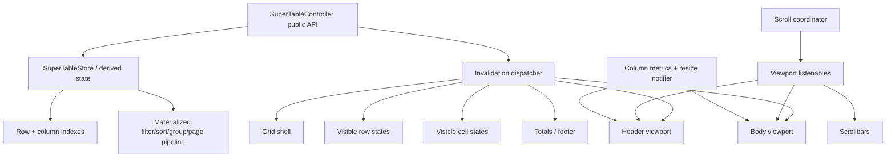

# Super Table Field 3.0.0 Performance Architecture Study

**Package under review:** `super_table_field` 2.8.0  
**Reference implementation:** [`doonfrs/trina_grid`](https://github.com/doonfrs/trina_grid)  
**Trina Grid revision studied:** `e3bffbeea7c5c69de5787bcd521777125031d619` (`v2.3.0`, 2026-07-22)  
**Target:** `super_table_field` 3.0.0  
**Study type:** static source-code and architecture review; this document does **not** claim measured runtime speedups yet.

---

## 1. Executive summary

`super_table_field` already has an important performance foundation: the body is vertically lazy through `ListView.builder`, and fixed-height rows use `itemExtent`. The largest remaining cost is not simply Flutter's scrolling implementation. It is the amount of work triggered around each visible row and each controller mutation.

The strongest ideas worth adopting from Trina Grid are:

1. **Granular state invalidation instead of rebuilding the whole table.** Trina combines a state manager with tagged notifications and widget-specific filters. Individual grid sections subscribe only to the state changes that can affect them.
2. **Two-axis virtualization.** Trina vertically virtualizes rows and also has a custom visibility layout that creates only horizontally visible cells/columns. `super_table_field` currently virtualizes rows but builds every column for every visible row.
3. **Materialized data state.** Filtering, sorting, grouping and pagination should be computed when their inputs change, not every time a getter is read from a build method.
4. **Dedicated scroll/layout channels.** Scroll offsets, scrollbar metrics and column resizing should update small `Listenable`/rendering surfaces without issuing a table-wide state change.
5. **Stable row/cell identity plus revisions.** Trina uses row versions and cell keys to invalidate derived work. `super_table_field` already has stable row identity and a `fingerPrint`, so v3 can extend this concept rather than replace the domain model.

The most urgent issue in the uploaded 2.8.0 source is the current render pipeline. `renderList` calls `_rebuildRenderList()` every time it is accessed. `_rebuildRenderList()` calls filtering and sorting again, and it uses `_rows.indexOf(row)` inside row loops. In `SuperTable`'s `ListView.builder`, `c.renderList` is read multiple times for one item build. This can make simply bringing new rows into the viewport repeatedly execute full-data work. **This should be the first v3.0.0 performance change, before implementing custom scrolling.**

A good v3 target is therefore not “copy Trina Grid.” It is a **new SuperTable render/state engine informed by Trina's successful principles**, while keeping SuperTable's public domain API, design-system integration, typed rows, editing model and existing features.

---

## 2. Scope and methodology

I reviewed the uploaded `super_table_field` 2.8.0 package with emphasis on:

- controller notification topology;
- the filtering/sorting/grouping/pagination pipeline;
- row and cell construction;
- horizontal and vertical scrolling;
- width resolution and intrinsic measurement;
- hover, selection and edit updates;
- row/cell identity and caching opportunities.

I reviewed the current Trina Grid repository at the pinned revision above, especially:

- `lib/src/manager/trina_grid_state_manager.dart`
- `lib/src/manager/trina_change_notifier.dart`
- `lib/src/manager/trina_change_notifier_filter.dart`
- `lib/src/ui/miscellaneous/trina_state_with_change.dart`
- `lib/src/ui/trina_body_rows.dart`
- `lib/src/ui/trina_base_row.dart`
- `lib/src/ui/trina_base_cell.dart`
- `lib/src/ui/miscellaneous/trina_visibility_layout.dart`
- `lib/src/manager/state/scroll_state.dart`
- `lib/src/widgets/trina_linked_scroll_controller.dart`
- `lib/src/helper/filtered_list.dart`
- filtering and column-state implementations.

The conclusions below are architectural conclusions from code inspection. Before claiming a percentage improvement, v3 needs a reproducible profile-mode benchmark suite described in Section 11.

---

## 3. Current SuperTable 2.8.0 baseline

### 3.1 What is already good

The package should not be rewritten from zero. Several existing choices are compatible with a high-performance v3:

- The table body uses `ListView.builder`, so off-screen rows are not all instantiated.
- Fixed-height rows use `itemExtent`, reducing vertical layout work.
- Domain entities are already separated from presentation code.
- `SuperRow<R>` gives rows stable identity and exposes a `fingerPrint` rebuild token.
- The package has a dedicated `SuperTableController<R>` and a rich typed column model.
- Editing, validation, selection, grouping, aggregation, paging and runtime column configuration already exist; the performance work can focus on the engine underneath these capabilities.

### 3.2 The current hot path

In the uploaded source, `_SuperTableState.initState()` subscribes directly to the controller, and `_onModel()` executes a root `setState(() {})` on every controller notification (`super_table.dart`, approximately lines 637–686).

At the same time, `SuperTableController` contains **67 `notifyListeners()` call sites**. This means many logically small operations—including focus, selection, filtering and editing changes—can invalidate the complete `SuperTable` subtree.

The practical rebuild path is currently similar to:

```text
Controller mutation
      │
      ▼
notifyListeners()
      │
      ▼
_SuperTableState._onModel()
      │
      ▼
root setState()
      │
      ├── width resolution
      ├── header
      ├── filter row
      ├── body viewport
      ├── gutter
      ├── totals/footer
      └── visible rows × all columns
```

Vertical lazy construction prevents all rows from being built simultaneously, but it does not prevent a large amount of repeated work inside the visible region.

---

## 4. The biggest current bottlenecks

### P0 — `renderList`/`view` recompute the complete data pipeline on reads

In `super_table_controller.dart` approximately lines 1476–1568:

- `renderList` calls `_rebuildRenderList()` then returns `_renderCache`.
- `view` also calls `_rebuildRenderList()` then returns `_dataView`.
- `nRows` reads `view.length` and therefore rebuilds again.
- `_rebuildRenderList()` starts by reading `_sorted`.
- `_sorted` calls `_filtered` and can allocate/copy/sort a list.
- `_filtered` can scan every row and multiple columns.

The names `_renderCache` and `_dataView` suggest caching, but the getters currently rebuild the cache eagerly on **every access**.

This becomes much more expensive in `super_table.dart` around lines 1541–1565. The `ListView.builder` path reads `c.renderList.length`, then reads `c.renderList.length` again inside `itemBuilder`, then `c.renderList[i]`. Each getter call can rerun filtering/sorting/grouping. A second gutter list also references the render list.

This means a vertically lazy table can still do full-list CPU work whenever Flutter asks for a newly visible row.

**v3 action:** make derived data truly materialized. Recompute once when rows, search, filters, sorting, grouping, collapse state, page or page size change. Normal getters must be O(1) and allocation-free.

### P0 — source index lookup is O(n²)

Inside `_rebuildRenderList()`, each data item calculates:

```dart
sourceIndex: _rows.indexOf(row)
```

Doing an O(n) `indexOf` inside an O(n) row loop makes render-item construction O(n²) in the common case. The grouped path repeats the same pattern.

**v3 action:** maintain a stable index map such as `Map<RowId, int> _sourceIndexById`, rebuilt in O(n) only when the source row structure changes.

### P0 — column lookup/resolution repeatedly allocates and searches

The column getters around lines 1310–1349 repeatedly create `_baseCols`, pin subsets and middle columns. `midCols` resolves ordered keys using `firstWhere` on the base list for each key, making column resolution O(m²). `colByKey` is also linear.

**v3 action:** materialize column layout state and maintain:

- `Map<String, SuperColumn> columnByKey`;
- `Map<String, int> columnIndexByKey`;
- resolved start/middle/end arrays;
- prefix offsets for the visible column geometry.

### P1 — full-table rebuilds for granular state

The controller's global `ChangeNotifier` is useful as a public compatibility surface, but it is too coarse as the internal render subscription.

Examples:

- a focus change calls `notifyListeners()`;
- hover state calls root `setState()` in `_setHoveredRow` / `_setHoveredCell`;
- moving selection can cause the entire table to rebuild although only the old and new cells/rows materially changed.

**v3 action:** introduce scoped invalidation/revision channels and let each presentation component subscribe only to the channels it needs.

### P1 — no horizontal cell virtualization

`SuperTable` wraps the full column content in a horizontal `SingleChildScrollView`. For each vertically visible row, `_buildRow()` loops through every column:

```dart
for (var ci = 0; ci < cols.length; ci++)
  _bodyCell(...)
```

Therefore, if 20 rows are visible and the table has 100 columns, the body can create work for roughly 2,000 cells even if only 8–12 columns are visible horizontally.

Trina's `TrinaVisibilityLayout` addresses exactly this problem: it activates only cells intersecting the horizontal viewport and deactivates off-screen cells.

**v3 action:** virtualize the middle columns horizontally, while preserving pinned start/end panes and keeping the editing/current cell alive when needed.

### P1 — `maxCell` width measurement scans all rows during layout resolution

`_maxCellWidth()` in `super_table.dart` approximately lines 1390–1429 iterates through all rows and runs `TextPainter.layout()` for their displayed text. `_resolveColumnWidths()` can call this while the table builds.

If a controller change causes the root table to rebuild, expensive intrinsic measurement can be repeated even though row values, font metrics and the column did not change.

**v3 action:** cache intrinsic widths by column and content/style revision. Width measurement must be invalidated only when relevant cell values, formatter, font/style or column configuration changes.

### P2 — manual gutter scroll synchronization

The main vertical scroll controller manually drives a second gutter controller with `jumpTo()` (`_syncGutter()`). This is workable, but it introduces another per-scroll synchronization path.

**v3 options:** either make the row-number gutter part of the same vertically virtualized row, or use linked scroll positions similar to Trina when multiple panes must remain synchronized.

---

## 5. What makes Trina Grid feel fast

Trina's performance is produced by several layers working together, not by a single scrolling widget.

### 5.1 Tagged notifications and filtered subscriptions

`TrinaChangeNotifier` extends `ChangeNotifier` but also emits a `TrinaNotifierEvent`. State-manager methods can attach a notifier identifier when they mutate state.

`TrinaChangeNotifierFilterResolverDefault` then maps widget types to the specific state-manager operations that matter to them. For example, body rows react to row/column/filter/sort/page structural changes, while unrelated changes can be ignored.

`TrinaStateWithChange` subscribes to that filtered stream and compares the old and new local value before calling `markNeedsBuild()`.

The important lesson is not the exact use of RxDart or method `hashCode`. The important lesson is:

> **The render tree receives semantic invalidation, not one global “something changed” signal.**

### 5.2 Row virtualization plus horizontal visibility virtualization

`TrinaBodyRows` uses `ListView.builder` / `TrinaSmoothListView.builder` for rows. It also places cells inside `TrinaVisibilityLayout`.

`TrinaVisibilityLayout` is a custom `RenderObjectWidget`/Element implementation. It watches the horizontal scroll controller, calculates the visible interval and only keeps children whose horizontal range intersects that interval. It can preserve a cell when `keepAlive` is required.

It also avoids rebuilding for every pixel: its scroll listener tracks the previous visible boundaries and only requests a rebuild when the visibility range needs to change.

That makes the number of cell widgets roughly proportional to:

```text
visible rows × visible columns
```

instead of:

```text
visible rows × all columns
```

This is particularly important for ERP/accounting tables, where 50–150 columns are realistic.

### 5.3 Scroll metrics are isolated from the body rebuild

`TrinaBodyRows` uses `ValueNotifier<double>` instances for vertical/horizontal offset, extent and viewport metrics. Scroll listeners update these values without calling the body's `setState`.

The scrollbars consume those listenables directly. Therefore a high-frequency scroll offset does not need to flow through the main grid state manager.

### 5.4 Separate relayout from rebuild for column resizing

Trina layout delegates use a `resizingChangeNotifier` as their `relayout` source. Column resizing can therefore trigger layout without treating every drag delta as a semantic grid-state change requiring a full widget rebuild.

### 5.5 Batching mutations

Trina state methods commonly call dependent operations with `notify: false`, then emit one final tagged notification. For example, sorting or structural column updates can perform several internal state changes and notify once.

This is a useful pattern for SuperTable's selection, edit commit, filter reset, group changes and column configuration flows.

### 5.6 Cached derived values and row versioning

`TrinaCell` caches a sorting value, and `TrinaRow` has a `version` counter used to invalidate callback-derived cell state. `_CellContainerState` also caches read-only calculation results based on cell value and row version.

The broader principle is to avoid repeating pure derived work during every build when the input revision is unchanged.

### 5.7 Linked scroll positions

Trina's `LinkedScrollControllerGroup` synchronizes peer `ScrollPosition`s and deduplicates offset notifications. This is more robust than a set of independent listener/jump loops when header/body/frozen panes must move together.

---

## 6. Trina ideas to adopt—and ideas not to copy blindly

| Trina technique | Recommendation for SuperTable 3 | Reason |
|---|---|---|
| Tagged state changes | **Adopt the concept** | Essential for granular rebuilds |
| Widget-specific notification filtering | **Adopt** | Prevents irrelevant subtree rebuilds |
| Vertical `ListView.builder` | **Keep existing SuperTable approach** | Already correct |
| Horizontal visibility virtualization | **Adopt, but improve implementation** | Large gain for wide tables |
| ValueNotifiers for scroll metrics | **Adopt** | Removes scroll offset from root state |
| Dedicated resize notifier | **Adopt** | Separates layout from semantic state |
| Linked scroll positions | **Adopt where multiple panes remain** | Cleaner synchronization |
| Row version/cache invalidation | **Adopt/merge with `fingerPrint`** | Good fit with current domain model |
| `FilteredList` exact implementation | **Do not copy** | Some getters allocate copies; build a SuperTable-specific data store |
| Method `hashCode` as public invalidation key | **Do not copy** | Opaque and brittle; explicit enums/bit masks are clearer |
| RxDart solely for internal events | **Not necessary initially** | Native `StreamController`, `ValueNotifier`, or custom dispatcher is enough |
| Forked Flutter `ListView`/`Scrollable` | **Do not make this a v3 prerequisite** | High framework-maintenance cost; profile first |
| `addRepaintBoundaries: false` everywhere | **Benchmark before adopting** | Workload-dependent trade-off |
| Custom Element/RenderObject code without tests | **Avoid** | Powerful but must have strong lifecycle/render tests |

Trina Grid is MIT licensed. If implementation code is copied directly rather than independently reimplemented, the relevant MIT copyright/license obligations must be preserved. Architectural ideas can be reimplemented independently; that is the preferred approach for the v3 engine.

---

## 7. Proposed SuperTable 3.0.0 architecture

### 7.1 Architectural goal

Keep the public controller/API ergonomic, but stop using the controller's broad `ChangeNotifier` as the internal rendering signal.



### 7.2 Suggested internal invalidation model

Use an explicit enum/bitset rather than method hashes:

```dart
enum SuperTableInvalidation {
  rows,
  columns,
  dataView,
  layout,
  viewport,
  selection,
  editing,
  cellValue,
  validation,
  hover,
  aggregates,
  style,
}
```

The internal dispatcher can publish a bit mask plus optional row/cell identifiers. A mutation should describe **what became invalid**, not merely call a global listener.

Examples:

- hover cell changed → `{hover, oldCell, newCell}`;
- selection moved → `{selection, oldCell, newCell}`;
- one cell edited → `{cellValue, rowId, columnKey}` and maybe `{aggregates}` if the edited column contributes to totals;
- filter changed → `{dataView}`;
- column width dragged → `{layout}` only;
- column order/pin/visibility changed → `{columns, layout}`.

For backward compatibility, `SuperTableController` may continue to call `notifyListeners()` once after a public transaction so external listeners do not break. **Internal SuperTable widgets should subscribe to the granular dispatcher instead.**

### 7.3 Batch/transaction mutations

Add an internal and optionally public transaction mechanism:

```dart
controller.batch(() {
  // multiple mutations
});
```

The dispatcher accumulates invalidation flags and affected IDs, then publishes one event at the end. This prevents “clear selection → update edit → change rows → notify” chains from producing several UI passes.

---

## 8. Materialized data pipeline design

This is the first implementation priority.

### 8.1 Required state

Maintain data revisions and cached views:

```text
sourceRows
  ├── rowIndexById
  └── rowsRevision
        │
        ▼
filteredRows      [filterRevision]
        │
        ▼
sortedRows        [sortRevision]
        │
        ▼
grouped/rendered  [groupRevision + collapseRevision]
        │
        ▼
pagedRenderItems  [pageRevision]
```

Each stage recomputes only if an input revision changes. In practice, a single dirty-mask pipeline can be simpler than storing a revision for every stage.

### 8.2 Getter contract

For v3, these getters should be cheap:

- `renderList` → O(1), no allocation, no filtering/sorting;
- `view` → O(1), no allocation;
- `nRows` → O(1);
- `colByKey` → average O(1);
- source row index by stable ID → average O(1).

A useful test is to call each getter 10,000 times after the cache is warm and assert that pipeline rebuild counters remain unchanged.

### 8.3 Index by stable row identity

`SuperRow` already has an `id`; use it. Build:

```dart
Map<int, int> _sourceIndexById;
```

when row structure changes. Do not use object `indexOf` while materializing render items.

### 8.4 Search/filter debounce

For interactive text search, allow a configurable debounce (for example 100–200 ms) before recomputing an expensive local filter over tens of thousands of rows. Programmatic filter APIs should still be deterministic and optionally immediate.

For truly large/server-backed data, v3 should keep supporting event-only/remote filtering modes rather than forcing all filtering to run locally.

---

## 9. Two-dimensional viewport engine

### 9.1 Vertical axis

Keep `ListView.builder` for rows. It is already a mature, efficient virtualizer. Preserve fixed extent/item extent when row heights are constant.

Avoid replacing it with a custom scrolling implementation until benchmarks prove that the standard Flutter list is the bottleneck after the state/data fixes.

### 9.2 Horizontal axis

Introduce a `SuperColumnMetrics` structure:

```text
columnKeys[]
widths[]
prefixOffsets[]
totalWidth
```

Given `scrollOffset` and `viewportWidth`, find the visible start and end indices using binary search. Complexity becomes O(log m) to find boundaries.

Build only:

```text
visible start index - overscan
...
visible end index + overscan
```

A small overscan of one or two columns usually prevents visible pop-in during fast scrolling. Make it configurable internally after profiling.

This improves on Trina's concept: Trina's visibility element scans the column sequence to determine visibility; SuperTable can exploit precomputed prefix offsets and binary search.

### 9.3 Pinned columns

Treat the table as three horizontal panes:

```text
[start pinned] [virtualized middle viewport] [end pinned]
```

Only the middle pane horizontally scrolls. All panes share the same vertical row viewport/indexing. The middle header, filter row, body and totals use the same `SuperColumnMetrics` instance so widths cannot drift.

### 9.4 Editing keep-alive

The active editor must remain mounted while editing. If a horizontal scroll would move the active cell outside the overscan range, either:

- keep that cell alive explicitly until editing ends, or
- commit/cancel according to current product behavior before deactivating it.

The first option matches Trina's “keep current cell alive” concept and is usually better UX.

---

## 10. Rebuild boundaries for the v3 presentation layer

Recommended presentation decomposition:

```text
SuperTable
└── SuperGridShell
    ├── SuperHeaderViewport
    ├── SuperFilterViewport
    ├── SuperBodyViewport
    │   └── lazy SuperRowView
    │       └── visible SuperCellView
    ├── SuperTotalsViewport
    ├── SuperGutterViewport (only if not integrated into row)
    └── SuperOverlayLayer
```

### `SuperGridShell`

Rebuild only for structural layout/theme/configuration changes.

### `SuperBodyViewport`

Rebuild for data-view structure or column geometry changes, not for hover of a single cell.

### `SuperRowView`

Owns row hover/selection/row-style state and subscribes to row-specific revisions.

### `SuperCellView`

Owns current/edit/validation/dirty/cell-style state and subscribes to cell-specific revisions.

### `SuperOverlayLayer`

Editor popups, menus, tooltips and validation overlays should listen to their own anchor/edit state rather than force body rebuilds.

This lets an arrow-key selection movement ideally rebuild the previous and new selected cells plus any selection-stat display—not the entire grid.

---

## 11. Width, layout and painting strategy

### 11.1 Cache intrinsic widths

For `SuperColumnWidthFit.maxCell`, cache the measured value with a key that represents:

- column key/configuration revision;
- relevant row/content revision;
- formatter revision if configurable;
- text style/font revision;
- text direction if it changes measurement.

Do not run `TextPainter.layout()` across all rows because hover or focus changed.

For very large datasets, consider an explicit policy:

- exact all-row measurement;
- viewport/sample measurement;
- caller-provided intrinsic width;
- incremental maximum maintained as data is loaded/edited.

Do not silently change semantics in 3.0.0; expose the policy if behavior differs.

### 11.2 Resize relayout channel

During a column drag:

- update column metrics;
- notify a dedicated `layoutRevision` / resize `Listenable`;
- relayout only header/body/footer geometry;
- do not recompute filters, sorting, groups or aggregates;
- delay expensive auto-fit recalculation until drag end.

### 11.3 Repaint boundaries

Do not copy Trina's `addRepaintBoundaries: false` without measurement. Whether per-row repaint boundaries help depends on cell complexity, scrolling platform and GPU workload. Include both configurations in the benchmark harness before choosing a default.

---

## 12. Scroll architecture

### High-frequency rule

A raw scroll offset is viewport state, not business/table state. It must not travel through the main controller notification path.

Use:

- `ScrollController` / `ScrollPosition` for actual movement;
- lightweight `ValueNotifier` or a custom viewport listenable for metrics;
- linked scroll positions only when multiple independently rendered panes must mirror movement;
- `AnimationController`/scroll physics only for behavior, not for data-state invalidation.

### Gutter recommendation

If possible, render row numbers/row actions within the same vertical row object. That removes an entire secondary vertical list and its synchronization.

If frozen left/right panes or a separate gutter require multiple vertical scrollables, use a linked-controller abstraction so synchronization happens at the scroll-position layer rather than repeated external `jumpTo` listeners.

### Smooth scrolling

Trina includes modified Flutter `ListView`/scrolling code for its smooth-scrolling mode. That is a maintenance-heavy technique because framework internals evolve.

For SuperTable 3.0.0:

1. first fix data recomputation, rebuild scope and horizontal virtualization;
2. benchmark standard Flutter scrolling in profile mode;
3. only then prototype custom smooth scrolling if frame timing still shows the scrollable itself as the bottleneck.

---

## 13. Proposed implementation sequence for 3.0.0

| Phase | Work | Expected impact | Risk |
|---|---|---:|---:|
| **0** | Add reproducible performance benchmark app/tests | Enables trustworthy decisions | Low |
| **1** | Materialize `renderList`/`view`; dirty flags; row/column maps | **Very high** | Low–Medium |
| **2** | Add granular invalidation + mutation batching | **Very high** | Medium |
| **3** | Split presentation into shell/body/row/cell rebuild boundaries | **Very high** | Medium–High |
| **4** | Add horizontal column virtualization + column metrics | **Very high for wide grids** | High |
| **5** | Cache `maxCell` widths; separate resize relayout | High | Medium |
| **6** | Unify/replace gutter sync; linked pane scrolling | Medium | Medium |
| **7** | Optimize style/callback caches and aggregates | Medium–High | Medium |
| **8** | Experiment with custom smooth scrolling only if profiling justifies it | Unknown | High |
| **9** | Migration docs, changelog, examples, performance documentation | Release quality | Low |

A practical release path is `3.0.0-alpha.1` after Phases 1–3, `3.0.0-beta.1` after horizontal virtualization and benchmark stabilization, then `3.0.0` once compatibility and performance gates pass.

---

## 14. Performance benchmark specification

### 14.1 Test datasets

At minimum:

| Dataset | Purpose |
|---|---|
| 1,000 rows × 20 columns | baseline/common table |
| 10,000 × 20 | vertical/data-pipeline pressure |
| 10,000 × 100 | two-axis virtualization pressure |
| 50,000 × 20 | large local dataset |
| grouped 10,000 × 40 | grouping/collapse pipeline |
| editable 5,000 × 40 | selection/edit/validation interaction |

Use deterministic generated values so runs are comparable.

### 14.2 Scenarios

Measure separately:

- initial mount to first stable frame;
- vertical fling;
- horizontal fling;
- wheel/trackpad continuous scroll;
- arrow-key selection navigation;
- mouse hover across rows/cells;
- enter edit / type / commit;
- sort one column;
- global search and per-column filter;
- group expand/collapse;
- resize column continuously;
- show/hide/reorder/pin column;
- totals/aggregate update after a cell edit.

### 14.3 Metrics

Capture:

- UI/build frame time p50/p95/p99;
- raster frame time p50/p95/p99;
- count of frames exceeding 16.67 ms and 32 ms on the reference environment;
- initial mount elapsed time;
- filter/sort/group operation elapsed time separately from render time;
- number of `SuperRowView` and `SuperCellView` builds per interaction;
- number of live cell widgets at rest for wide tables;
- memory and GC activity during long flings;
- allocations from render-list getters after caches are warm.

### 14.4 Proposed acceptance criteria

These are **targets**, not measured results from this study:

- In a 10k × 100 table, mounted body cells should scale with visible rows × visible columns + overscan, not visible rows × 100.
- Hovering one cell must not rebuild `SuperGridShell` or the full body.
- Moving single-cell selection should normally invalidate only old/new selection surfaces plus dependent status UI.
- `renderList`, `view`, `nRows` and `colByKey` reads must not trigger filtering/sorting/grouping or allocate complete lists.
- Column resize must not execute the data pipeline.
- On the chosen reference desktop/web device, normal continuous scrolling should remain inside the 60 Hz frame budget for the representative datasets, with p95 total frame work below ~16 ms and no recurring long-frame pattern. If 120 Hz is a product requirement, define a separate ~8.3 ms gate.
- No performance feature may regress edit correctness, keyboard navigation, RTL alignment, pinned-column alignment, accessibility or validation behavior.

---

## 15. Suggested tests to prevent regressions

In addition to existing functional tests, add performance-oriented invariants:

1. **Pipeline rebuild counter test** — repeated getters do not rebuild derived data.
2. **One mutation/one materialization test** — a filter change materializes the view once.
3. **Selection rebuild test** — moving selection does not rebuild the grid shell.
4. **Hover rebuild test** — hovering affects only the relevant row/cell.
5. **Horizontal viewport test** — a 100-column table only mounts the visible range + overscan.
6. **Pinned alignment test** — pinned and scrolling panes maintain identical row heights and vertical offsets.
7. **Editor keep-alive test** — horizontal/vertical scrolling does not destroy an active editor unexpectedly.
8. **Resize isolation test** — continuous width changes do not increment data-pipeline revisions.
9. **RTL virtualization test** — visible-range math works in RTL and with start/end pinned columns.
10. **Dynamic width invalidation test** — changing a relevant value invalidates only the required intrinsic-width cache.

Where possible, expose diagnostic counters only in debug/test builds, for example:

```text
pipelineRebuildCount
visibleRowBuildCount
visibleCellBuildCount
layoutRevision
viewportRevision
```

These make performance behavior testable rather than subjective.

---

## 16. Proposed internal file/module shape

The exact names can change, but the following separation fits the existing package while keeping domain entities independent of Flutter rendering details:

```text
lib/src/features/super_table/
├── domain/
│   └── entities/                 # keep public row/column/change entities
├── application/
│   ├── super_table_store.dart    # source + materialized derived state
│   ├── super_table_indexes.dart  # row/column O(1) indexes
│   └── super_table_pipeline.dart # filter/sort/group/page stages
└── presentation/
    ├── controllers/
    │   └── super_table_controller.dart  # public MVC controller/facade
    ├── state/
    │   ├── super_invalidation.dart
    │   ├── super_invalidation_dispatcher.dart
    │   └── super_table_revisions.dart
    ├── rendering/
    │   ├── super_column_metrics.dart
    │   ├── super_column_viewport.dart
    │   └── super_scroll_coordinator.dart
    └── widgets/
        ├── super_table.dart
        ├── super_grid_shell.dart
        ├── super_header_viewport.dart
        ├── super_body_viewport.dart
        ├── super_row_view.dart
        ├── super_cell_view.dart
        └── super_totals_viewport.dart
```

This structure keeps MVC semantics clear: the public controller coordinates actions/state, while rendering-specific optimization remains in the presentation layer and pure data derivation can live outside the widget tree.

---

## 17. Priority matrix

| Improvement | Rows impact | Columns impact | Interaction impact | Complexity | Priority |
|---|---:|---:|---:|---:|---:|
| Materialized render pipeline | Very high | Medium | High | Medium | **P0** |
| O(1) row/column indexes | High | High | Medium | Low | **P0** |
| Granular invalidation | High | High | Very high | Medium–High | **P1** |
| Horizontal virtualization | Medium | Very high | High | High | **P1** |
| Intrinsic width cache | High | High | Medium | Medium | **P1** |
| Resize-only relayout | Medium | High | High | Medium | **P1** |
| Scroll metric isolation | Medium | Medium | High | Low–Medium | **P1** |
| Linked multi-pane scroll | Medium | Medium | Medium | Medium | P2 |
| Callback/style memoization | Medium | Medium | Medium | Medium | P2 |
| Custom smooth scrolling | Unknown until profiling | Unknown | Medium | High | P3 |

---

## 18. Immediate v3 coding recommendation

The first code milestone should **not** start with a custom `RenderObject` or a forked scrolling widget. It should start with the controller/data pipeline because that removes unnecessary work everywhere, including scrolling.

Recommended first milestone:

1. introduce row/column indexes;
2. turn `renderList`, `view`, `sortedRows`, resolved columns and page count into materialized cached state;
3. add dirty flags/revisions and batch invalidation;
4. make the current `SuperTable.build` capture one immutable render snapshot for the frame;
5. add benchmark counters and baseline profile tests;
6. only after that, split rebuild boundaries and add horizontal virtualization.

This sequence reduces risk and gives measurable gains before the most invasive rendering change.

---

## 19. Expected outcome

If the v3 engine follows the architecture above, its work should scale primarily with **what is visible and what actually changed**:

```text
Current tendency:
controller change
→ root rebuild
→ repeated derived-data reads
→ visible rows × all columns

Target v3 tendency:
semantic mutation
→ update one cached state stage
→ emit scoped invalidation
→ rebuild only affected viewport/row/cell
→ visible rows × visible columns
```

That is the central performance lesson from Trina Grid and the most appropriate direction for `super_table_field` 3.0.0.

---

## 20. Source references

### Trina Grid

- Repository: <https://github.com/doonfrs/trina_grid>
- Revision reviewed: <https://github.com/doonfrs/trina_grid/commit/e3bffbeea7c5c69de5787bcd521777125031d619>
- State manager: <https://github.com/doonfrs/trina_grid/blob/e3bffbeea7c5c69de5787bcd521777125031d619/lib/src/manager/trina_grid_state_manager.dart>
- Tagged notifier: <https://github.com/doonfrs/trina_grid/blob/e3bffbeea7c5c69de5787bcd521777125031d619/lib/src/manager/trina_change_notifier.dart>
- Notifier filtering: <https://github.com/doonfrs/trina_grid/blob/e3bffbeea7c5c69de5787bcd521777125031d619/lib/src/manager/trina_change_notifier_filter.dart>
- Scoped widget state: <https://github.com/doonfrs/trina_grid/blob/e3bffbeea7c5c69de5787bcd521777125031d619/lib/src/ui/miscellaneous/trina_state_with_change.dart>
- Body row virtualizer: <https://github.com/doonfrs/trina_grid/blob/e3bffbeea7c5c69de5787bcd521777125031d619/lib/src/ui/trina_body_rows.dart>
- Row rendering: <https://github.com/doonfrs/trina_grid/blob/e3bffbeea7c5c69de5787bcd521777125031d619/lib/src/ui/trina_base_row.dart>
- Cell rendering: <https://github.com/doonfrs/trina_grid/blob/e3bffbeea7c5c69de5787bcd521777125031d619/lib/src/ui/trina_base_cell.dart>
- Horizontal visibility layout: <https://github.com/doonfrs/trina_grid/blob/e3bffbeea7c5c69de5787bcd521777125031d619/lib/src/ui/miscellaneous/trina_visibility_layout.dart>
- Scroll state: <https://github.com/doonfrs/trina_grid/blob/e3bffbeea7c5c69de5787bcd521777125031d619/lib/src/manager/state/scroll_state.dart>
- Linked scroll controller: <https://github.com/doonfrs/trina_grid/blob/e3bffbeea7c5c69de5787bcd521777125031d619/lib/src/widgets/trina_linked_scroll_controller.dart>
- Filtered list: <https://github.com/doonfrs/trina_grid/blob/e3bffbeea7c5c69de5787bcd521777125031d619/lib/src/helper/filtered_list.dart>

### Super Table Field 2.8.0 uploaded source

Primary files reviewed:

- `lib/src/features/super_table/presentation/controllers/super_table_controller.dart`
- `lib/src/features/super_table/presentation/widgets/super_table.dart`
- `lib/src/features/super_table/presentation/widgets/super_cell.dart`
- `lib/src/features/super_table/domain/entities/super_row.dart`

Key local evidence referenced in this report:

- root controller listener / root `setState`: `super_table.dart` ~637–686;
- hover root `setState`: `super_table.dart` ~626–634;
- column materialization/lookup getters: `super_table_controller.dart` ~1310–1349;
- filtering/sorting pipeline: `super_table_controller.dart` ~1375–1468;
- render-list recomputation and `_rows.indexOf`: `super_table_controller.dart` ~1476–1568;
- main vertical builder and repeated `c.renderList` reads: `super_table.dart` ~1541–1565;
- every-column row build: `super_table.dart` ~2496–2518;
- max-cell text measurement over all rows: `super_table.dart` ~1390–1429.

---

## 21. Final recommendation

Proceed with `3.0.0` as a performance-architecture release centered on **cached derived state, granular invalidation, and two-axis virtualization**. Preserve SuperTable's API and design-system behavior wherever practical, but treat the internal state/render pipeline as a new engine.

The single highest-priority fix is to stop `renderList`/`view` from recomputing the full pipeline on reads. The highest-impact rendering change after that is horizontal column virtualization. Trina Grid validates both architectural directions, while its more maintenance-heavy techniques—especially a forked Flutter scrolling implementation—should remain optional until profiling proves they are necessary.
